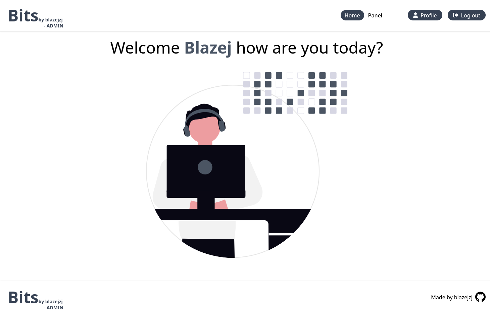
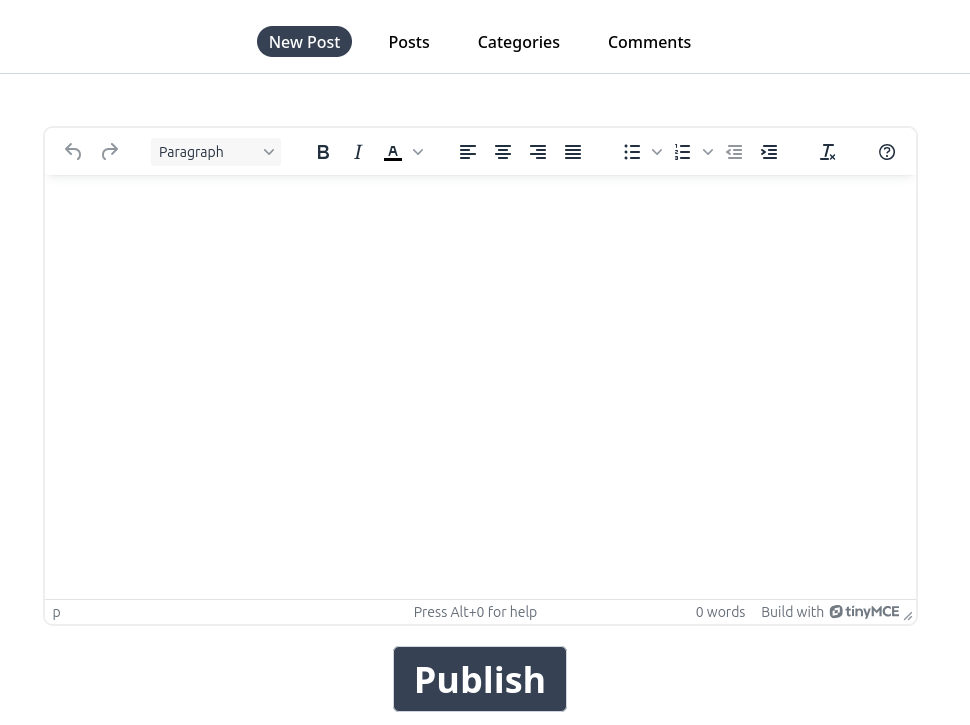
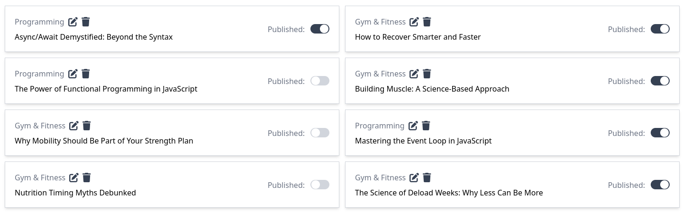
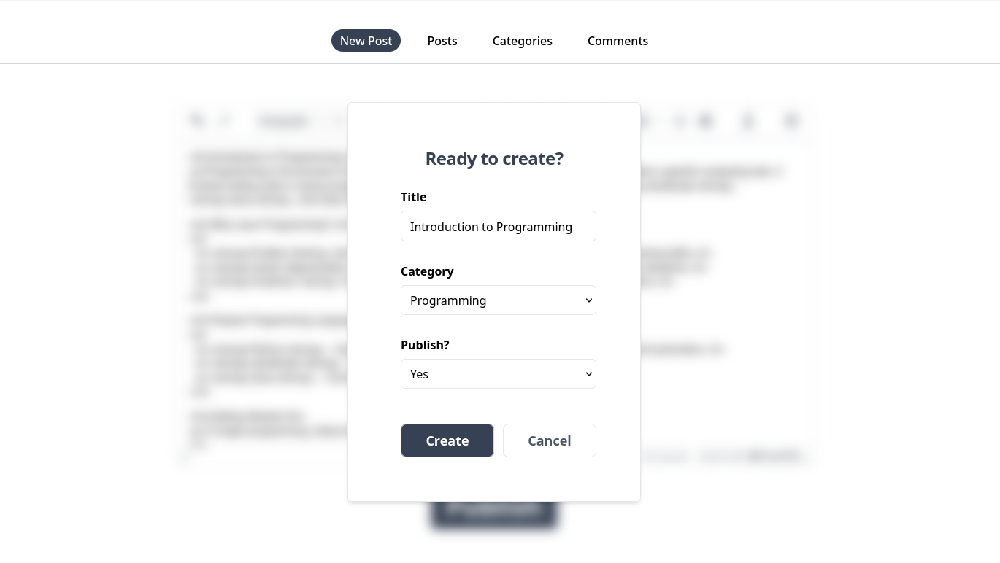
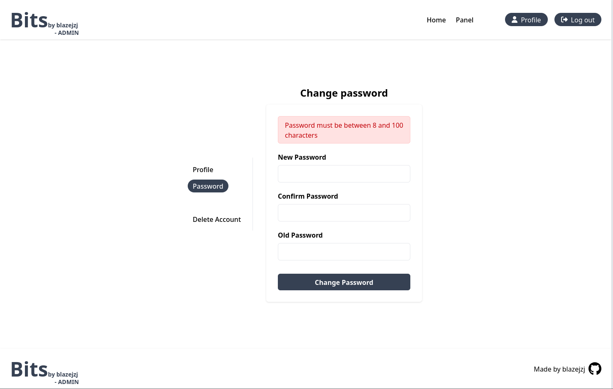
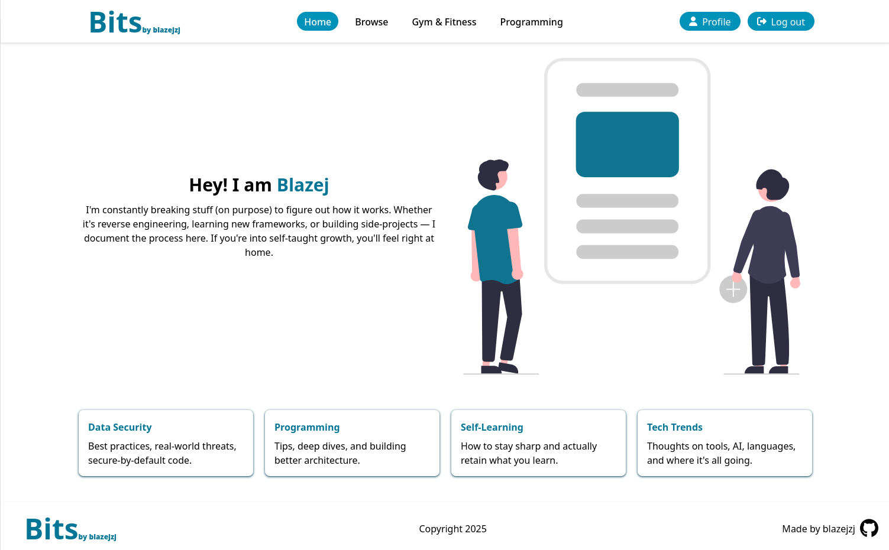
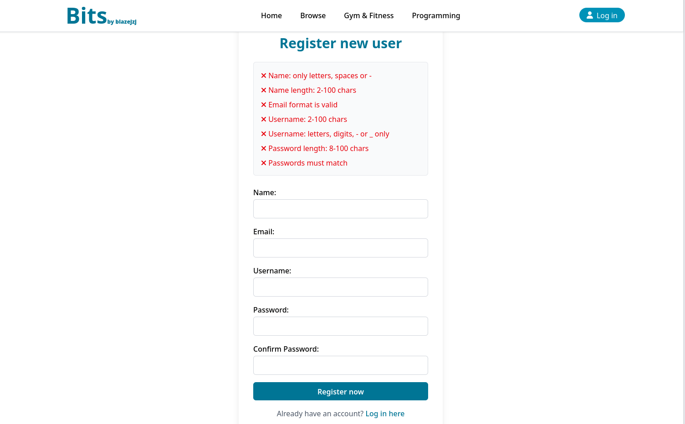
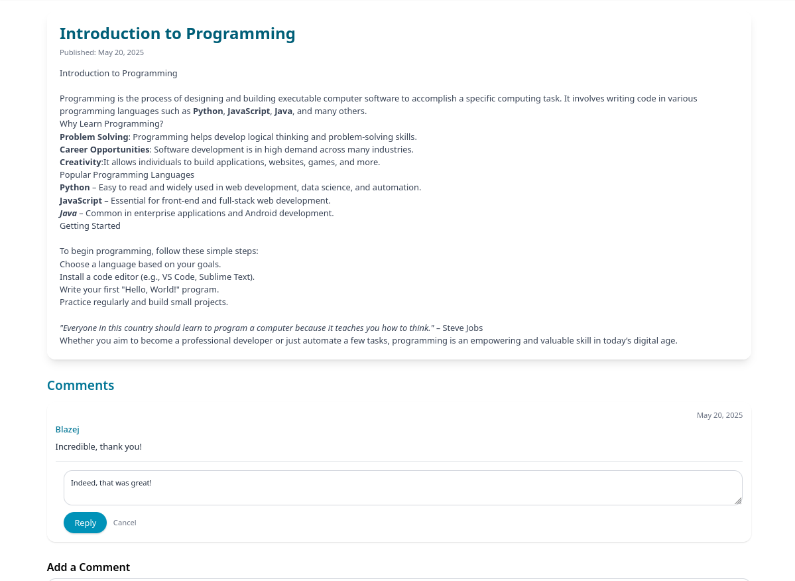
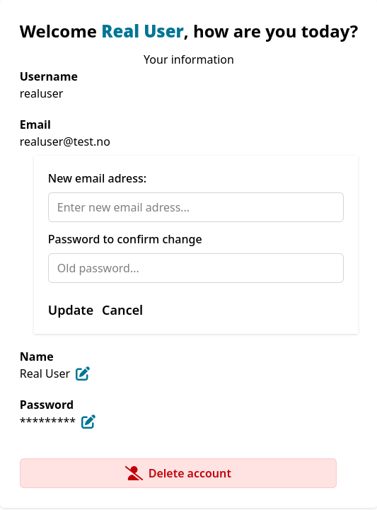
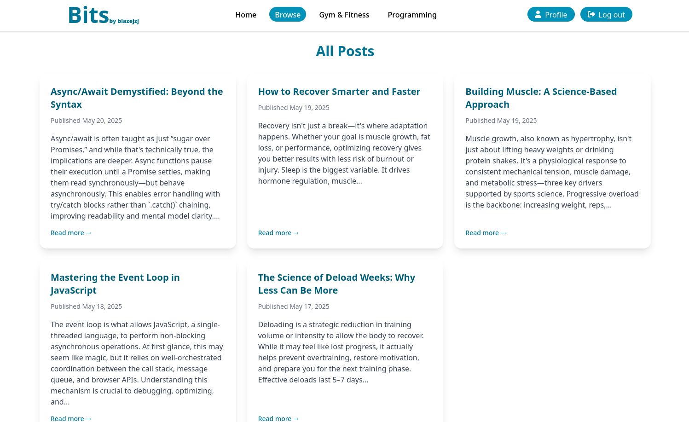

# **Blog Platform – Fullstack Project**

## **Tech Stack**
- Frontend: React (TypeScript), TailwindCSS
- Backend: Node.js, Express, Prisma ORM, PostgreSQL
- Auth: JWT (stored in cookies)
- Testing: Vitest

```
/frontenduser     ← Public blog site (register/login, read + comment)
/frontendadmin    ← Admin dashboard (create/edit/publish)
/backend          ← REST API with auth, posts, comments
```
## **Features**

### **Admin Dashboard (/frontendadmin)**
- Login with JWT auth
- Create, edit, delete blog posts
- Publish/unpublish with one click
- See all posts in a dashboard view
- Manage comments

### **Public Blog (/frontenduser)**
- View all published posts
- Read full blog content
- Post comments and respond to them when logged in
- Manage your profile informatiion

## **Screenshots**

### Admin Dashboard 
  

  

  
  
  

  

---

### Public Blog 
  

  
  
  
 
  

  
